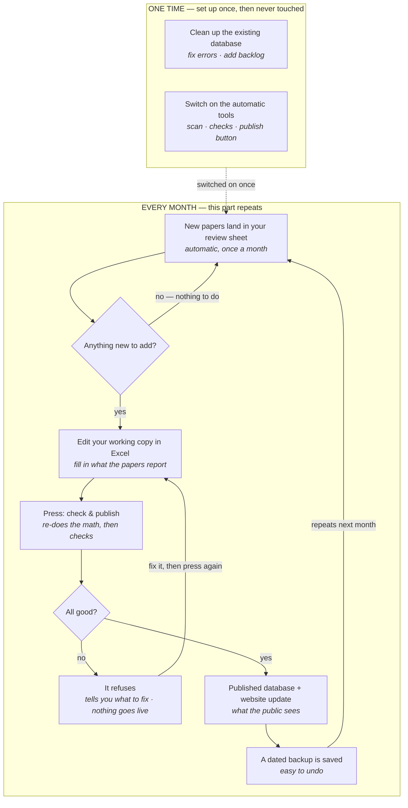

# cNPDB maintenance — the target design

This is the agreed shape of how cNPDB should be maintained day-to-day. It is
written for **non-coders**: the people keeping the database current are mostly
not programmers and are not expected to know GitHub, CI, or the command line.

> **Status: agreed, not yet built.** This describes where we are going, not what
> exists today. See "What still has to be built" at the bottom. The current
> tooling is described in [`README.md`](README.md) and [`PROJECT_STATE.md`](PROJECT_STATE.md).

## The whole thing on one page

A maintainer's entire mental model: *"Once a month I check whether there's
anything new. Usually there isn't. If there is, I edit a spreadsheet and press
one button — and if I got something wrong, it tells me in plain English."*

## The four ideas that make it safe

1. **Two kinds of columns.** Every column is either **from the paper** (a human
   types it: sequence, family, species/OS, tissue, evidence, PTM, DOI) or
   **computed** (mass, length, properties, the FASTA header, the IDs). A person
   never needs to get a computed column right — see idea 2.

2. **Computed columns are re-derived on every publish.** The monoisotopic mass
   and all properties are recalculated from the sequence + PTM whenever you
   publish, overwriting whatever is in the cell. So editing a computed cell by
   hand simply doesn't matter — it gets corrected. This alone removes ~97 of the
   130 existing mass errors and prevents new ones. (The ~33 high-severity mass
   errors are really *wrong sequences* and still need a human to check the paper.)

3. **The file you edit is not the file the public sees.** You edit a **working
   copy**. The published database is a separate file, produced only by the
   button. There is no path from a raw hand-edit to the website that skips the
   check — so people *can* freely touch the Excel; a mess stays in the sandbox.

4. **Every publish is reversible.** A dated backup is saved before each publish,
   so "undo" is "restore yesterday's copy," never "call a programmer."

The check itself is not new — it is the same set of validations that already run
as unit tests + the database-integrity gate. The change is running them **where
the maintainer works**, in plain language, instead of as a red X on GitHub.

## What can't be automated (say this out loud)

If someone types a **wrong-but-plausible sequence** — valid amino acids, a
believable mass, just not what the paper reported — no tool catches it. Only
reading the source paper does. The plumbing exists to catch the *mechanical*
mistakes (wrong mass, bad code, broken sequence, out-of-scope family, deleted
rows) so human attention is spent on the one thing only humans can do.

## One-time vs. every-month (don't confuse them)

- **One-time:** the QC cleanup (fixing the 130 masses / 115 missing species /
  inline `(d)` sequences), merging the historical backlog, deciding the scope
  question (the 35 out-of-scope entries, incl. the Figure 4D actin peptide), and
  wiring up the automatic tools + one-button publish. Done once. **Not** part of
  routine maintenance — keeping it separate is what stops the day-to-day from
  feeling endless.
- **Every month:** the loop above. Mostly it idles with nothing to do.

## What still has to be built

The diagram's "automatic" labels are only true once these exist:

1. **One-button `publish`** (not a command line) that: re-derives all computed
   columns, runs the checks with plain-English output, writes a new dated
   snapshot, saves a backup, and repoints the app + updates the safety baseline
   itself — so no coder step is left for a human.
2. **A "correct an existing row" path.** Today the only writer *appends* new rows
   and rejects any existing sequence as a duplicate; it cannot fix an existing
   entry. Corrections need to ride the same publish-a-new-snapshot path as
   additions.
3. **The working-copy / published-file split**, with computed columns hidden or
   clearly marked in the working copy.
